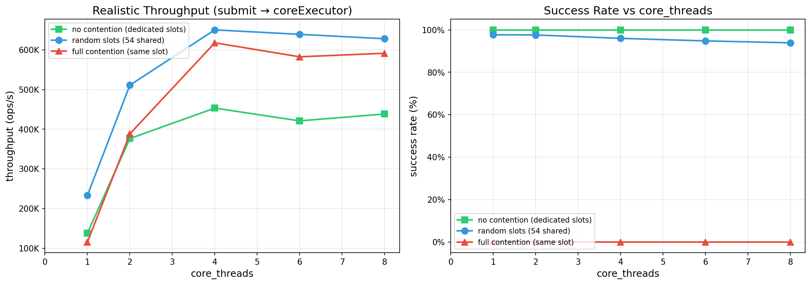

# TheExchange — Minecraft 跨服物品交换

基于 TLS 1.3 加密信道和乐观锁并发控制的跨服共享空间模组，各服务器之间可以互相查看、放入、取出物品。

## 配置

配置文件位于 `config/theexchange/theexchange.json`，首次启动自动生成。支持热重载。

```jsonc
{
  "server": {
    "display_name": "Default Server",     // 本服名称，显示在容器标题
    "port": 25566,                        // 监听端口 1–65535
    "password": "changeme"                // 连接密码（TLS 内传输，TOFU 公钥固定防中间人）
  },
  "network": {
    "heartbeat_interval_seconds": 10,     // 心跳间隔
    "heartbeat_timeout_seconds": 30,      // 超时判定离线
    "reconnect_initial_delay_seconds": 5, // 重连初始延迟
    "reconnect_max_delay_seconds": 30,    // 重连最大延迟（指数退避上限）
    "request_timeout_seconds": 5,         // PUT/TAKE 请求超时
    "inbound_enabled": false              // 是否接受入站连接
  },
  "cache": {
    "offline_retention_hours": 24,        // 离线缓存保留时长
    "local_inventory_cache_capacity": 32, // 本地库存 LRU 容量
    "remote_inventory_cache_capacity": 64 // 远端缓存 LRU 容量
  },
  "performance": {
    "core_threads": 4                     // 工作线程池大小（上限 = CPU 核心数）
  },
  "logging": {
    "retention_days": 30,                 // 操作日志保留天数
    "cleanup_interval_hours": 1           // 日志清理间隔
  },
  "container": {
    "rows": 6,                            // 容器行数（固定 6，即 9×6=54 槽）
    "title_template": "{server_name} 的共享空间"
  },
  "remoteServers": [
    {
      "name": "创造服",
      "address": "10.0.0.2",
      "port": 25566,
      "password": "changeme"
    }
  ]
}
```

### 热重载

修改配置文件后执行 `/exchange config reload` 生效。以下配置项可用 `/exchange config set <path> <value>` 实时修改后 reload，无需手动编辑文件：

| path | 类型 | 说明 |
|------|------|------|
| `server.display_name` | string | 本服名称 |
| `server.port` | int (1–65535) | 监听端口 |
| `server.password` | string | 连接密码 |
| `network.heartbeat_interval_seconds` | int (>0) | 心跳间隔 |
| `network.heartbeat_timeout_seconds` | int (>0) | 心跳超时 |
| `network.reconnect_initial_delay_seconds` | int (>0) | 重连初始延迟 |
| `network.reconnect_max_delay_seconds` | int (>0) | 重连最大延迟 |
| `network.request_timeout_seconds` | int (>0) | 请求超时 |
| `network.inbound_enabled` | bool | 接收入站连接 |
| `cache.*` | int (>0) | 缓存各项容量/时长 |
| `performance.core_threads` | int (>0) | 线程池大小 |
| `logging.*` | int (>0) | 日志保留/清理间隔 |
| `container.title_template` | string | 标题模板 |

远端服务器用 `remote add/remove` 子命令管理。

## 命令

所有命令以 `/exchange` 为根。

### 查看共享空间

```
/exchange view <server>    打开指定服务器的共享空间 GUI
/exchange view local       打开本服共享空间
/exchange refresh <server> 手动刷新指定服务器的共享空间
```

- 在线时：实时操作，查看、放入、取出
- 离线时：只读查看缓存数据，标题显示 `[离线]`
- 不兼容物品（跨版本无法解析）：显示为屏障方块，禁止操作

### 服务器列表

```
/exchange server list      列出所有已配置的远端服务器及在线状态
/exchange list             同上
```

### 配置管理（需 OP 权限）

```
/exchange config show                   展示完整配置
/exchange config get <path>             读取单个配置项
/exchange config set <path> <value>     设置配置项（需 reload 后生效）
/exchange config reload                 热重载配置
/exchange config remote list            列出远端服务器
/exchange config remote add <name> <address> <port> <password>  添加远端
/exchange config remote remove <name>   移除远端
/exchange reload                        热重载（同上）
```

### 操作日志

```
/exchange log export [days]  导出最近 N 天操作日志（默认 30）
/exchange log clear [days]   清理 N 天前的日志（默认 30，需 OP）
```

## 安全

- **TLS 1.3** 加密信道，AES-256-GCM / AES-128-GCM
- **TOFU 公钥固定**：首次连接自动保存对端公钥到 `config/theexchange/tls/known-peers.properties`，后续连接校验公钥一致，防止中间人攻击
- **密码认证**：TLS 握手后在应用层二次鉴权
- **防重放**：滑动窗口（1024 位）+ 时间戳（±60s）+ 单调序列号
- **乐观锁**：每个槽位独立版本号，并发冲突时拒绝操作并刷新 GUI

## 架构

```
core/                         纯 Java 核心库，零 Minecraft 依赖
  model/                      数据模型、缓存、乐观锁
  network/                    TCP/TLS 网络协议栈、防重放
  storage/                    SQLite 持久化、LRU 缓存
  service/                    业务逻辑、同步引擎、心跳
  compat/                     跨版本兼容、物品序列化接口

src/                          Fabric 适配层
  fabric/command/             指令注册
  fabric/container/           虚拟容器（原版 9×6 GUI）
  fabric/item/                ItemStack ↔ NeutralItem 序列化
  fabric/config/              配置文件加载
```

## 并发基准测试

测试机器：Intel Ultra 9 285H (6P+8E)，JDK 21.0.8，Windows 11

### 生产线程模型

所有业务操作统一走 `submit()` → `coreExecutor`。`coreExecutor` 是固定大小线程池，线程数 = `performance.core_threads`（默认 4）。网络 I/O 由 `Connection` 的 daemon 线程处理，不占用 coreExecutor。

```
玩家点击 / 远端请求
      │
      ▼
  TheExchangeCore.submit()
      │
      ▼
  coreExecutor (core_threads 个线程)
      │
      ▼
  ExchangeService → LocalInventoryCacheManager → LocalInventoryCache
```

### 测试方法

完全模拟生产路径。每条操作完整经过 `submit()`（真实 taskMonitor + generation 检查）→ `LocalItemStore` → `LocalInventoryCacheManager` → `LocalInventoryCache`（StampedLock 乐观读 + 槽位锁）→ `CompatibilityChecker.checkAndMark()` → `OperationLogger.log()`（内存队列）。仅排除网络 I/O 和 DB 异步刷盘。每个 caller 执行 20K 次 take+put。3 种竞争场景：

| 场景 | 说明 |
|------|------|
| 零竞争 | 每个 caller 独占 2 个槽位 |
| 随机竞争 | caller 随机选择 54 个共享槽位 |
| 完全竞争 | 所有 caller 抢夺同一个槽位 |

### 结果

横轴 `core_threads` 即 `performance.core_threads` 配置值。`submit()` 将实际并发攻击缓存的线程数限制为 K，2K 个 caller 在 taskMonitor 上排队。



| core_threads | 零竞争 (ops/s) | 随机竞争 (ops/s) | 完全竞争 (ops/s) |
|------|------------|------------|------------|
| 1 | 138K | 233K | 116K |
| 2 | 376K | 511K | 388K |
| 4 | 453K | 650K | 618K |
| 6 | 421K | 639K | 583K |
| 8 | 438K | 628K | 591K |

### 结论

- `submit()` 充当天然并发限流器——实际碰缓存的始终只有 K 个 coreExecutor 线程，StampedLock 竞争近乎零
- 零竞争反而最慢：同一 submit 内对同槽位 take+put 导致缓存行 invalidation；随机竞争 take/put 命中不同槽位，缓存局部性更好
- 4→8 线程无明显提升：CPU 为 Intel Ultra 9 285H（6P+8E），超过 6 线程后分配至 E-core，单核性能下降抵消了更多并发的收益
- 默认 `core_threads=4` 时全路径 450K~650K ops/s，Minecraft 玩家交互 ~10-100 QPS，有 **3-4 个数量级余量**

### 本地运行

```bash
# 仅正确性测试（默认 test 任务不含基准测试）
./gradlew test

# 基准测试 + 生成图表（需要 Python 3 + matplotlib）
bash bench.sh                      # Git Bash / WSL
.\bench.ps1                        # PowerShell
.\bench.ps1 -Python D:\python.exe  # 指定 Python 路径
```

生成 `bench_data.csv`（原始数据）和 `bench_report.png`（吞吐/成功率折线图）。
