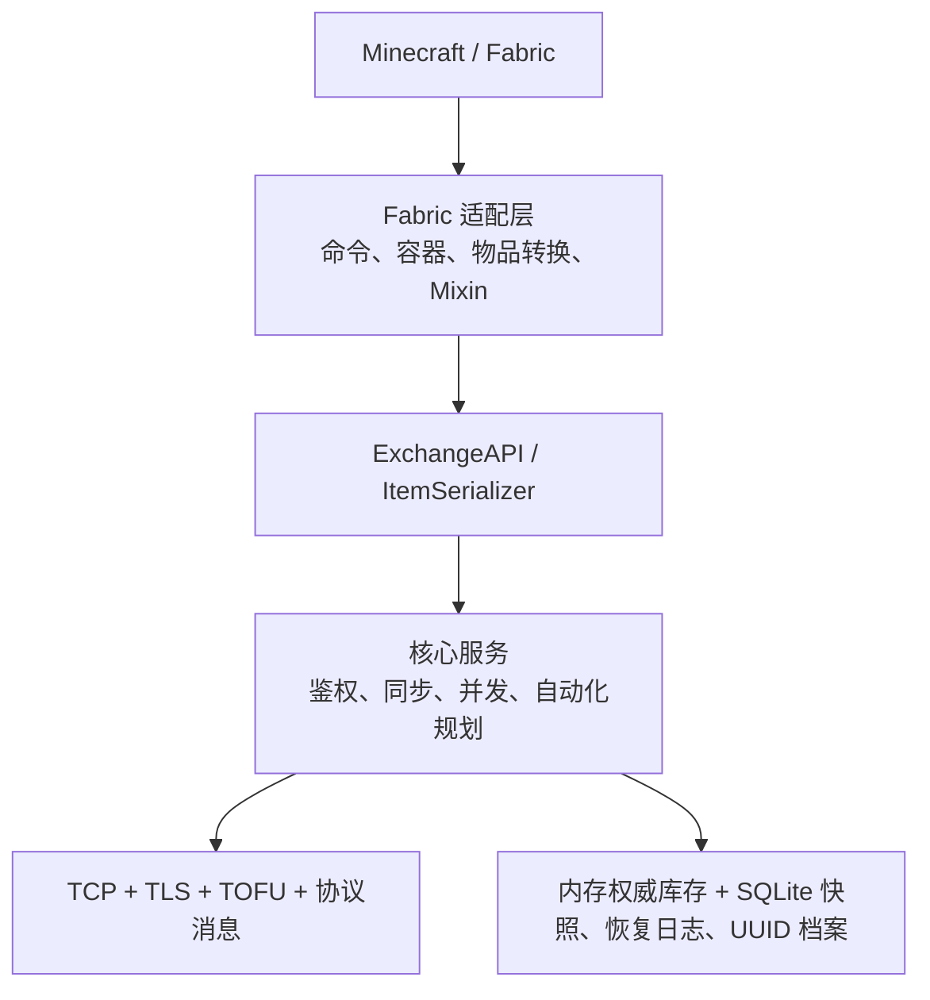
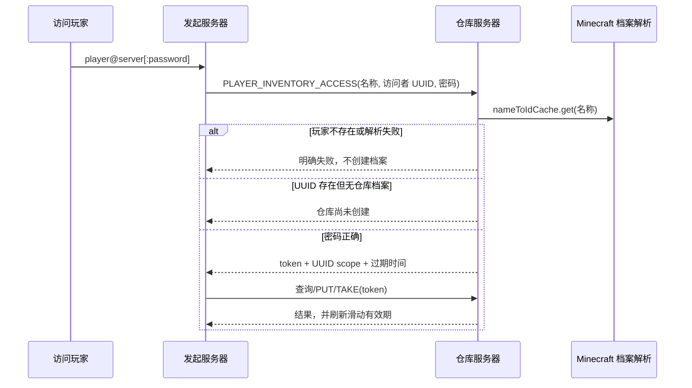
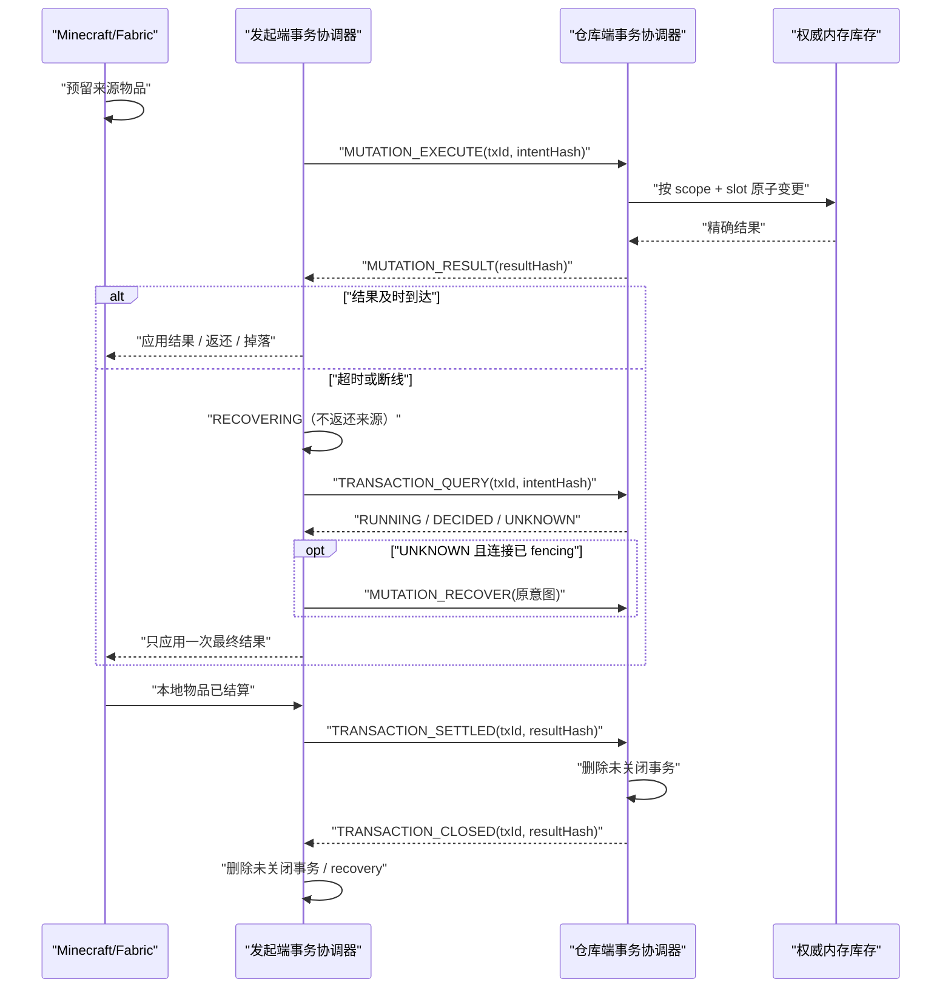

# TheExchange — 当前架构实现

> 本文描述仓库中的实际实现。需求背景见 `REQUIREMENTS.md`，使用方法见根目录 `README.md`。

## 1. 设计边界

TheExchange 是对等的服务端 Mod。每台服务器只对自己持有的库存负责，其他服务器只能通过 TLS 协议查询或提交带版本条件的变更。

实现分成一个与 Minecraft 无关的核心和三个很薄的 Fabric 适配层：

```text
core/                    Java 核心：协议、鉴权、库存、缓存、并发与持久化
fabric-1.21.11/          Minecraft 1.21.11 / Java 21 适配
fabric-26.1/             Minecraft 26.1.2 / Java 25 适配
fabric-26.2/             Minecraft 26.2 / Java 25 适配
ref/                     Minecraft/Fabric 参考源码
```

`core` 不引用 Minecraft、Fabric 或具体 `ItemStack` 类型。三个 Fabric 模块保持同样的目录和职责，版本差异只留在适配层。

## 2. 分层与依赖方向



核心中的主要职责如下：

- `model/`：`NeutralItem`、`InventoryScope`、连接串、视图和交互模型。
- `service/`：库存读写、同步、短期会话、更新订阅、GUI 决策和漏斗槽位规划。
- `network/`：连接管理、请求/响应关联、帧编解码、防重放、TLS 和 TOFU 首次公钥固定。
- `storage/`：库存异步快照、远端快照、未关闭事务恢复、结算仓、操作日志和玩家仓库密码档案。
- `compat/`：由加载器实现的中立物品序列化边界。

Fabric 适配层中的主要职责如下：

- `command/`：管理员命令、普通共享空间命令、玩家仓库命令。
- `container/`：54 槽服务端虚拟容器；所有点击最终进入核心服务。
- `player/`：解析玩家仓库连接、复用令牌、只提示补输密码并打开界面。
- `block/`：读取实际附着在末影箱上的告示牌。
- `automation/`：末影箱端点委托和非阻塞漏斗桥。
- `mixin/`：只在末影箱使用和漏斗输入/输出入口接管行为。

## 3. 库存模型与持久化

### 3.1 Scope

所有库存都以 `InventoryScope` 区分：

- `SERVER`：服务器公共共享空间，`scope_id` 固定为空串。
- `PLAYER`：玩家私有共享空间，`scope_id` 是规范化的小写 UUID 字符串。

每个 scope 有 54 个槽位。槽位号必须在 `0..53`；查询、批量查询和所有写操作都在进入缓存或数据库前校验边界。

### 3.2 中立物品

跨版本传输使用 `NeutralItem`，保存物品标识、数量和版本相关的额外字节。目标服务器是兼容性的最终裁决者：不能还原的物品不能由玩家放入或取出；漏斗抽取规划会跳过本地不兼容的候选槽位。

### 3.3 SQLite

数据库启用 WAL、外键和 5 秒 busy timeout，并由公平 `ReentrantLock` 串行化连接访问。关键表为：

- `exchange_items(scope_type, scope_id, slot, item_data, ..., version)`：本服权威库存。
- `inventory_metadata(scope_type, scope_id, last_modified)`：scope 修改时间。
- `remote_cache(server_name, scope_type, scope_id, slot, ..., version)`：只读远端快照。
- `player_inventory_auth(player_uuid, password_hash, created_at, updated_at)`：玩家仓库档案。
- `mutation_recovery(direction, peer_id, transaction_id, ...)`：只保存网络异常或关服时仍未关闭的事务；事务关闭后立即删除。
- `settlement_vault(transaction_id, owner_uuid, item_blob, ...)`：重启后已失去原 Minecraft 投递目标的返还物或取出物。

玩家仓库档案只保存 UUID、密码哈希和时间戳，不保存角色名。旧的含 `scope_id`/`player_name` 表会在一个事务内迁移到 UUID-only 表。

## 4. 玩家身份解析和档案生命周期

玩家仓库连接使用 `<player>@<server>:<password>`，密码可省略。连接串中的玩家名称不是持久主键，仅用于在仓库所在服务器解析 UUID。

两个 Fabric 实现都调用：

```java
server.services().nameToIdCache().get(playerName)
```

这与对应 Minecraft 版本自己的命令/档案解析路径一致：

- 玩家不必在线；缓存内的已知玩家和认证服务器可解析的正版玩家都会得到档案。
- 在线认证模式下，缓存未命中会交给 `GameProfileRepository`，认证服务器返回不存在时得到 `Optional.empty()`。
- 离线模式下，Minecraft 自己按其离线用户规则生成档案和 UUID。
- TheExchange 不猜测、不合成 UUID，也不因一次远程查询创建玩家仓库档案。
- 解析为空返回“玩家不存在或无法解析”；解析器异常作为独立失败返回，不会继续认证或创建 scope。

档案只在玩家本人执行 `/exchange player password <password>` 时创建或修改，UUID 直接取当前在线玩家的游戏档案。名称能解析但未主动创建档案时，认证明确返回“玩家仓库不存在或尚未创建”。

## 5. 玩家仓库鉴权与纯内存令牌

### 5.1 密码和锁定

玩家仓库密码使用 PBKDF2-HMAC-SHA256、120,000 次迭代和每条档案独立随机盐。密码只出现在获取短期会话的请求中，后续库存请求不再携带密码。

同一来源服务器和访问玩家连续 5 次认证失败后锁定 10 分钟。成功认证会清除该访问主体的失败计数。修改仓库密码会撤销该 scope 的已有会话。

服务器间连接密码是另一层认证：它保存在服务器私有配置中，通过 TLS 通道发送；当前设计不对这个配置值额外做哈希。TLS 保留首次连接信任并固定对端公钥的 TOFU 行为。

### 5.2 会话

认证成功后，仓库服务器生成 32 字节安全随机 token：

- 原始 token 只返回给发起服务器，并只保存在发起方进程内存。
- 仓库服务器只在内存保存 token 的 SHA-256 摘要。
- 会话绑定 `来源 peer + 访问者 UUID + 目标 PLAYER scope`，不能换 peer、换玩家或换仓库使用。
- 默认有效期 5 分钟；每次成功查询或变更都在两端刷新滑动过期时间。
- 到期后必须重新输入密码。
- 重启、正常关闭或成功热重载会清空 token、失败计数、订阅和自动化委托。

令牌没有数据库或配置存储入口，也不会写入远端缓存或日志。因此令牌不会跨进程生命周期持久化。

`player_inventory.enabled` 是本服玩家仓库总门禁，默认开启。发起端 core 在读取本地/远端缓存、认证和修改前检查门禁；仓库持有端在认证以及所有 PLAYER scope 查询/变更的统一 access resolution 中再次检查，因此任一端关闭都能拒绝访问。Fabric 菜单在门禁关闭后失效，漏斗在预扣物品之前快速拒绝。公共 SERVER scope 不经过该门禁。已经进入可靠性协议的事务仍允许完成对账和结算，避免管理员切换配置的瞬间破坏物品守恒，但不会开始新的玩家仓库变更。

### 5.3 认证流程



如果连接串省略密码且没有有效 token，协调器只保存一个 2 分钟的待认证目标，提示 `/exchange player login <password>`；它不会保存旧密码，也不会要求重输完整连接串。

## 6. 网络协议

连接使用 TLS 1.3。二进制帧固定 28 字节头，magic 为 `EXCH`，帧封装版本和应用层版本均为 2，最大 payload 为 10 MiB；连接内序列窗口和时间戳用于拒绝重放。认证版本不是 `2` 会收到 `UNSUPPORTED_PROTOCOL` 后断开，不保留旧 PUT/TAKE/SWAP 帧、旧编解码或 V1 分支。

V2 的 `NeutralItem` 网络表示携带快照产生端计算的 `maxStackSize`。请求端只使用远端槽位快照中的值进行候选槽规划；空槽或不同物品没有远端上限可用时不会拿请求端规则代替。仓库持有端始终按自己的 Minecraft/Mod 环境重新计算，并由权威库存缓存执行最终上限检查。该字段不写入 SQLite：库存、远端快照、恢复日志和结算仓都不保存它。权威本地 LRU 从数据库恢复时重新计算；远端 LRU 或恢复结果中上限未知的非空槽会在在线增量同步时强制重新拉取槽位快照。作为非权威提示，它也不参与 `intentHash` 或 `resultHash`。

帧类型按职责分组：

| 范围 | 帧 |
|---|---|
| `0x0001..0x0003` | 服务器认证、认证响应、心跳 |
| `0x0004..0x0005` | 玩家仓库短期会话申请与响应 |
| `0x0010..0x001B` | 时间戳、物品、槽位状态及批量查询 |
| `0x0020..0x0026` | 变更执行/恢复、结果、状态查询、结算确认和关闭确认 |
| `0x0030` | scope 更新推送 |
| `0xFFFF` | 错误 |

公共 `SERVER` scope 的更新可发给已认证连接。`PLAYER` scope 的推送只发给当前仍持有该 scope 有效会话/订阅的 peer；仅建立服务器连接并不足以收到私有仓库变更。

## 7. 写入一致性与并发

权威服务器的变更路径为：

1. 解析并验证 scope；私有仓库先校验 token 并刷新有效期。
2. 校验槽位 `0..53`，再访问锁、缓存或数据库。
3. 以 scope + slot 为粒度串行化冲突写入。
4. 比较请求携带的 `expectedVersion`；不一致返回冲突和最新状态。
5. 以 `(来源 peer, transaction UUID)` 登记未关闭事务；`intentHash` 禁止同一 UUID 对应不同操作。
6. 提交权威内存库存和新版本，保存精确结果并向合格订阅者推送。
7. 发起端完成 Minecraft 侧发放、返还、掉落或结算仓存放后发送带 `resultHash` 的 `TRANSACTION_SETTLED`；权威端随后删除事务并在 `TRANSACTION_CLOSED` 中回显该哈希。



没有收到结果只会进入 `RECOVERING`，不会作为业务失败返还来源物品。发起端对同一 UUID 查询状态；权威端处于 `RUNNING` 时等待，处于 `DECIDED` 时返回原始结果，不存在时才在旧连接已被 fencing 后使用 `MUTATION_RECOVER` 执行原意图。结果、结算确认或关闭确认丢失都只会重放对应阶段，不会重放已经提交的库存变更。

接收端只保留尚未收到结算确认的结果，发起端只保留尚未收到关闭确认的事务。收到关闭确认后双方立即删除，不使用 TTL、LRU、历史请求表或 tombstone。并发继续由 scope + slot 锁和期望版本控制，不设置全局事务锁或固定 lane。

同一 peer 对同一事务 UUID 提供不同 `intentHash` 时，执行请求返回 `IDEMPOTENCY_CONFLICT`，状态查询返回显式 `CONFLICT`；查询方只结束并返还自己尚未提交的预留，不会把远端已有的另一笔事务误当成本次结果。

远端缓存始终只是展示快照。目标离线时可以打开普通服务器共享空间的缓存视图，但不能把缓存当作可写库存；玩家私有仓库也不能绕过有效会话读取实时数据。

本地权威 LRU 在一次内存变更期间会 pin 对应 scope，远端 LRU 在应用槽位更新期间采用同样的短期 pin。LRU 淘汰先在缓存仍可被同 key 查找到时完成最后一次快照写入，再移除条目；这样容量竞争不会产生同一 scope 的第二份陈旧缓存。pin 只覆盖单次内存操作，不把不同 scope 串行化。

GUI 操作会先在 Minecraft 主线程真实预留玩家物品，再异步发远程请求；结果回到主线程并完成确认、归还或掉落后，Fabric 才调用一次性 settlement 回调。核心的网络、重试和异常日志工作不阻塞服务器 tick 线程。

每个打开的 `ExchangeMenu` 使用独立的资源冲突 gate，而不是整会话单锁。点击会先同步分析其鼠标指针、玩家槽位和远端槽位资源；资源集合不相交的请求可以同时在途。相同鼠标指针、相同玩家槽、相同远端槽仍会拒绝后发请求；Shift 取出可能写入任意背包格，因此会声明全部玩家背包槽。gate 只保护在途操作涉及的资源，不改变权威端按 scope + slot 执行的并发控制。

## 8. 签名末影箱与漏斗

`AttachedEnderChestSign` 只接受实际支撑/附着到末影箱的墙牌、立式牌、墙挂牌或悬挂牌，并检查正反两面的四行文本。某行能严格解析为玩家仓库连接时才接管；无效告示牌保持原版末影箱行为。

玩家打开映射末影箱时复用同一个 `PlayerWarehouseAccessCoordinator` 和 54 槽 `ExchangeMenu`，因此命令和方块入口共享鉴权、缓存、乐观锁和不兼容物品规则。

漏斗桥遵循以下约束：

- 每个漏斗/漏斗矿车使用一把不区分推入和抽取的非阻塞 gate。同一端点有请求在途时，后续两个方向都立即返回 `false`，不排队、不等待，也不再次发起网络请求；远端结果在 Minecraft 主线程应用完成后才释放 gate。
- gate 是每漏斗而不是每仓库：多个输入漏斗、输出漏斗可以同时向同一仓库发起请求，继续由权威端的槽位锁、期望版本和事务 UUID 处理竞争，不因网络延迟把整个仓库串行化。
- 公平策略为每个漏斗维护独立的源漏斗槽位游标和远端仓库槽位游标。源游标跳过空格并轮流尝试每件候选物品，远端游标使用与 54 互质的步长遍历；即使某次因版本冲突或物品不能放入而失败，下次也会从不同位置开始。单个漏斗同时连接可用的远程输入和输出时，根据上次实际启动的方向交替让行。
- 公平状态只包含游标、上次方向和最后访问时间，不保存物品或 future；每 256 次实际访问才顺带清理超过 10 分钟未活动的条目，避免逐 tick 全表扫描。
- gate 只存在内存中，不复用 `HopperBlock.ENABLED`：后者属于红石状态，改写它会覆盖原版红石语义并可能把临时忙碌状态保存进区块。
- 推入时在主线程预留一件源物品，远端失败时只尝试归还原槽；原槽已不能接收时直接掉落，不改放其他槽。
- 菜单和漏斗共用核心 `ExchangeSlotPlanner`：放入只按远端槽位快照选择合并或空槽，抽取会跳过本地不能接收或不能反序列化的物品。
- Minecraft 容器状态只在主线程读取/修改；网络 future 不直接触碰游戏对象。
- 带密码的告示牌可自行认证。无密码告示牌必须先由玩家打开这一只末影箱并完成认证，产生的内存委托绑定“维度 + 方块坐标”，不能被其他末影箱复用。
- 自动化认证错误有退避，避免每个 tick 重试密码。

正常成功路径不执行同步 SQLite 事务写入。首次超时/断线、结算长时间未完成以及正常关服会把未关闭事务写入 recovery；接收端在收到状态查询（说明响应链路曾失败）时也记录该未关闭结果。恢复出的 PUT/SWAP 返还物以及 TAKE/SWAP 取出物在没有原 Minecraft 投递目标时进入 settlement vault。玩家仓库 token 仍然不持久化；恢复事务若远端返回 `UNKNOWN`，必须等同一访问者重新认证后才能重新执行。

该设计保证进程存活期间的网络抖动、响应丢失、断线重连和正常关服恢复。按当前明确接受的边界，进程在首次超时或关服检查点之前突然崩溃，仍可能丢失极短窗口内的内存事务。

## 9. 生命周期和线程模型

- `TheExchangeCore` 管理固定后台执行器、网络、数据库、缓存和服务对象。
- 每个连接有读取循环和异步发送；事务消息先在读取顺序中登记，再把互不冲突的业务处理交给核心执行器。
- Fabric 适配层通过服务器执行队列把容器和玩家状态变更切回主线程。
- 热重载先构建新配置；只有重载成功才清空现有玩家会话并重建连接状态。
- 关闭时先进入 draining、拒绝新变更、等待核心任务到达安全点、批量保存未关闭事务，再停止网络/心跳、刷写库存快照并关闭数据库。

## 10. 关键失败语义

| 情况 | 结果 |
|---|---|
| 目标玩家离线但 Minecraft 可解析 | 正常继续，不要求玩家在线 |
| 认证服务器返回玩家不存在 | 返回“玩家不存在或无法解析”，不创建 UUID 或档案 |
| 档案解析器抛异常 | 返回解析失败，不进入密码验证 |
| UUID 可解析但玩家从未创建仓库 | 返回“玩家仓库不存在或尚未创建” |
| token 到期、主体不匹配或已撤销 | 拒绝操作并要求重新输入密码 |
| 第 5 次错误密码 | 锁定该来源/访问者 10 分钟 |
| 槽位小于 0 或大于 53 | 在访问缓存和存储前返回 `INVALID_SLOT` |
| 远程物品不兼容 | 玩家操作拒绝；漏斗规划跳过 |
| 私有仓库发生更新 | 只通知持有该 scope 有效会话的 peer |
| 变更结果超时或连接断开 | 保留来源预留，进入 recovery，以同一事务 UUID 查询/恢复 |
| 迟到或重复结果 | 查活动事务/recovery，结果只结算一次，随后重发 settlement ACK |
| 结算后无法回到原 Minecraft 对象 | 掉落；跨正常重启恢复时写入 settlement vault |

## 11. 测试边界

核心测试覆盖身份解析结果、UUID-only 迁移、短期 token、滑动过期、锁定、主体绑定、订阅过滤、槽位校验、V2 事务协议编解码、意图/结果哈希、恢复日志不保存 token、结算仓幂等、并发、LRU 淘汰竞态和自动化槽位规划。事务协议另有独立的 loopback 验收夹具：在 `127.0.0.1` 上启动两个完整的 TLS/TCP `NetworkManager`，经过真实证书认证、帧编解码、连接读写线程和 fencing，仅在解码后的消息路由边界注入丢失、延迟与重复。事件轨迹保存完整消息，使测试可以核对事务 UUID、意图/结果哈希和 `UNKNOWN/RUNNING/DECIDED/CONFLICT` 状态，而不只统计帧类型。

loopback 套件覆盖 EXECUTE、RESULT、QUERY、STATUS、RECOVER、SETTLED、CLOSED 各阶段的恢复，伪造或不匹配的结果与 ACK，执行器异常，活动 UUID 冲突，执行中断线重连和旧连接 fencing。持久化场景使用真实 SQLite recovery/vault，关闭并重建单端或双端协调器后再通过 TCP 对账。物品守恒使用 core `NeutralItem` 构造来源预留、投递、返还、掉落和 vault 数据，对 PUT、TAKE、完整 SWAP 与受限合并分别按物品种类和数量做等式断言。并发正确性测试由 16 个调用线程通过真实 TLS/TCP 执行跨槽事务、同槽乐观锁竞争和重复帧风暴，同时区分 executor 调用次数与实际库存提交次数。独立的饱和 loadtest 使用异步有界窗口扫描 1–4096 笔在途事务；它关闭故障夹具的完整帧历史和逐 UUID 诊断计数，分别测量独立玩家仓库、随机共享槽位和同槽最坏竞争的吞吐、成功率及 RESULT 尾延迟。

26.2 适配层另有自动化委托 reset 回归测试；三个 Fabric 适配层都通过独立编译和构建验证版本 API 与 Mixin 注入点。Fabric 侧不复制 core 的协议可靠性测试。

常用验证命令：

```powershell
.\gradlew.bat test
.\gradlew.bat :fabric-1.21.11:build :fabric-26.1:build :fabric-26.2:build
.\gradlew.bat :fabric-1.21.11:runServer
.\gradlew.bat :fabric-26.1:runServer
.\gradlew.bat :fabric-26.2:runServer
```

涉及 Minecraft 行为时，以 `ref/minecraft-1.21.11-official-sources` 和 `ref/minecraft-26.1.2-sources` 中对应版本源码为准，不在核心中复制或猜测认证服务器逻辑。
