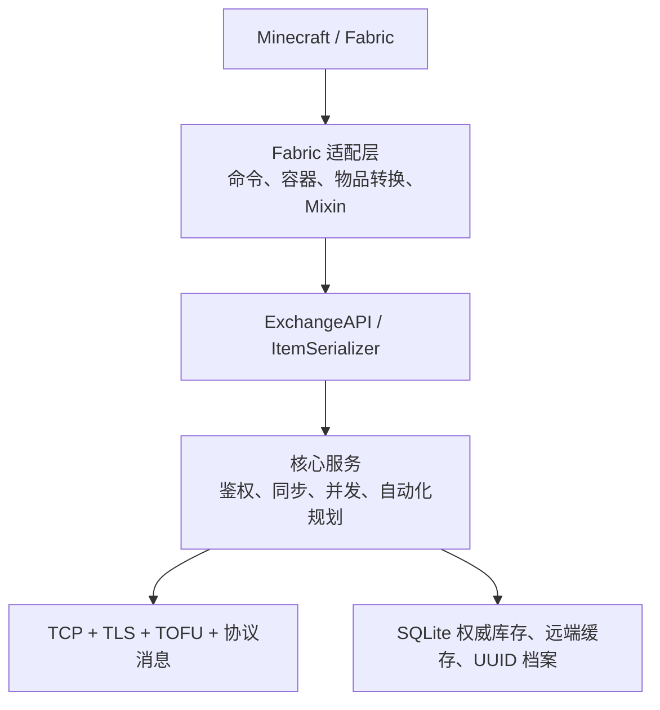
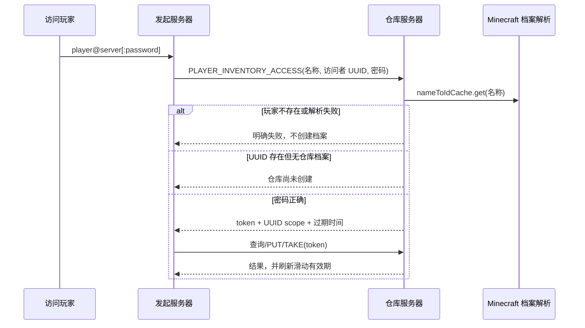

# TheExchange — 当前架构实现

> 本文描述仓库中的实际实现。需求背景见 `REQUIREMENTS.md`，使用方法见根目录 `README.md`。

## 1. 设计边界

TheExchange 是对等的服务端 Mod。每台服务器只对自己持有的库存负责，其他服务器只能通过 TLS 协议查询或提交带版本条件的变更。

实现分成一个与 Minecraft 无关的核心和两个很薄的 Fabric 适配层：

```text
core/                    Java 核心：协议、鉴权、库存、缓存、并发与持久化
fabric-1.21.11/          Minecraft 1.21.11 / Java 21 适配
fabric-26.1/             Minecraft 26.1.2 / Java 25 适配
ref/                     两个目标版本的 Minecraft/Fabric 参考源码
```

`core` 不引用 Minecraft、Fabric 或具体 `ItemStack` 类型。两个 Fabric 模块保持同样的目录和职责，版本差异只留在适配层。

## 2. 分层与依赖方向



核心中的主要职责如下：

- `model/`：`NeutralItem`、`InventoryScope`、连接串、视图和交互模型。
- `service/`：库存读写、同步、短期会话、更新订阅、GUI 决策和漏斗槽位规划。
- `network/`：连接管理、请求/响应关联、帧编解码、防重放、TLS 和 TOFU 首次公钥固定。
- `storage/`：SQLite 权威库存、远端快照、操作日志、玩家仓库密码档案。
- `compat/`：由加载器实现的中立物品序列化边界。

Fabric 适配层中的主要职责如下：

- `command/`：管理员命令、普通共享空间命令、玩家仓库命令。
- `container/`：54 槽服务端虚拟容器；所有点击最终进入核心服务。
- `player/`：解析玩家仓库连接、复用令牌、只提示补输密码并打开界面。
- `block/`：读取实际附着在末影箱上的告示牌。
- `automation/`：末影箱端点委托和非阻塞漏斗桥。
- `mixin/`：只在末影箱使用和漏斗输入/输出入口接管行为。

## 3. 库存模型与持久化

### 3.1 Scope

所有库存都以 `InventoryScope` 区分：

- `SERVER`：服务器公共共享空间，`scope_id` 固定为空串。
- `PLAYER`：玩家私有共享空间，`scope_id` 是规范化的小写 UUID 字符串。

每个 scope 有 54 个槽位。槽位号必须在 `0..53`；查询、批量查询和所有写操作都在进入缓存或数据库前校验边界。

### 3.2 中立物品

跨版本传输使用 `NeutralItem`，保存物品标识、数量和版本相关的额外字节。目标服务器是兼容性的最终裁决者：不能还原的物品不能由玩家放入或取出；漏斗抽取规划会跳过本地不兼容的候选槽位。

### 3.3 SQLite

数据库启用 WAL、外键和 5 秒 busy timeout，并由公平 `ReentrantLock` 串行化连接访问。关键表为：

- `exchange_items(scope_type, scope_id, slot, item_data, ..., version)`：本服权威库存。
- `inventory_metadata(scope_type, scope_id, last_modified)`：scope 修改时间。
- `remote_cache(server_name, scope_type, scope_id, slot, ..., version)`：只读远端快照。
- `player_inventory_auth(player_uuid, password_hash, created_at, updated_at)`：玩家仓库档案。

玩家仓库档案只保存 UUID、密码哈希和时间戳，不保存角色名。旧的含 `scope_id`/`player_name` 表会在一个事务内迁移到 UUID-only 表。

## 4. 玩家身份解析和档案生命周期

玩家仓库连接使用 `<player>@<server>:<password>`，密码可省略。连接串中的玩家名称不是持久主键，仅用于在仓库所在服务器解析 UUID。

两个 Fabric 实现都调用：

```java
server.services().nameToIdCache().get(playerName)
```

这与对应 Minecraft 版本自己的命令/档案解析路径一致：

- 玩家不必在线；缓存内的已知玩家和认证服务器可解析的正版玩家都会得到档案。
- 在线认证模式下，缓存未命中会交给 `GameProfileRepository`，认证服务器返回不存在时得到 `Optional.empty()`。
- 离线模式下，Minecraft 自己按其离线用户规则生成档案和 UUID。
- TheExchange 不猜测、不合成 UUID，也不因一次远程查询创建玩家仓库档案。
- 解析为空返回“玩家不存在或无法解析”；解析器异常作为独立失败返回，不会继续认证或创建 scope。

档案只在玩家本人执行 `/exchange player password <password>` 时创建或修改，UUID 直接取当前在线玩家的游戏档案。名称能解析但未主动创建档案时，认证明确返回“玩家仓库不存在或尚未创建”。

## 5. 玩家仓库鉴权与纯内存令牌

### 5.1 密码和锁定

玩家仓库密码使用 PBKDF2-HMAC-SHA256、120,000 次迭代和每条档案独立随机盐。密码只出现在获取短期会话的请求中，后续库存请求不再携带密码。

同一来源服务器和访问玩家连续 5 次认证失败后锁定 10 分钟。成功认证会清除该访问主体的失败计数。修改仓库密码会撤销该 scope 的已有会话。

服务器间连接密码是另一层认证：它保存在服务器私有配置中，通过 TLS 通道发送；当前设计不对这个配置值额外做哈希。TLS 保留首次连接信任并固定对端公钥的 TOFU 行为。

### 5.2 会话

认证成功后，仓库服务器生成 32 字节安全随机 token：

- 原始 token 只返回给发起服务器，并只保存在发起方进程内存。
- 仓库服务器只在内存保存 token 的 SHA-256 摘要。
- 会话绑定 `来源 peer + 访问者 UUID + 目标 PLAYER scope`，不能换 peer、换玩家或换仓库使用。
- 默认有效期 5 分钟；每次成功查询或变更都在两端刷新滑动过期时间。
- 到期后必须重新输入密码。
- 重启、正常关闭或成功热重载会清空 token、失败计数、订阅和自动化委托。

令牌没有数据库或配置存储入口，也不会写入远端缓存或日志。因此令牌不会跨进程生命周期持久化。

### 5.3 认证流程



如果连接串省略密码且没有有效 token，协调器只保存一个 2 分钟的待认证目标，提示 `/exchange player login <password>`；它不会保存旧密码，也不会要求重输完整连接串。

## 6. 网络协议

连接使用 TLS 1.3。二进制帧固定 28 字节头，magic 为 `EXCH`，帧封装版本为 1，应用层认证协议版本为 2，最大 payload 为 10 MiB；请求通过 request ID 关联，序列窗口和时间戳用于拒绝重放。

帧类型按职责分组：

| 范围 | 帧 |
|---|---|
| `0x0001..0x0003` | 服务器认证、认证响应、心跳 |
| `0x0004..0x0005` | 玩家仓库短期会话申请与响应 |
| `0x0010..0x001B` | 时间戳、物品、槽位状态及批量查询 |
| `0x0020..0x0025` | PUT、TAKE、SWAP 及响应 |
| `0x0030` | scope 更新推送 |
| `0xFFFF` | 错误 |

公共 `SERVER` scope 的更新可发给已认证连接。`PLAYER` scope 的推送只发给当前仍持有该 scope 有效会话/订阅的 peer；仅建立服务器连接并不足以收到私有仓库变更。

## 7. 写入一致性与并发

权威服务器的变更路径为：

1. 解析并验证 scope；私有仓库先校验 token 并刷新有效期。
2. 校验槽位 `0..53`，再访问锁、缓存或数据库。
3. 以 scope + slot 为粒度串行化冲突写入。
4. 比较请求携带的 `expectedVersion`；不一致返回冲突和最新状态。
5. 以 request ID 和 scope 记录近期结果，重复请求返回同一结果。
6. 提交权威库存和新版本，再更新缓存并向合格订阅者推送。

远端缓存始终只是展示快照。目标离线时可以打开普通服务器共享空间的缓存视图，但不能把缓存当作可写库存；玩家私有仓库也不能绕过有效会话读取实时数据。

GUI 操作会先在 Minecraft 主线程真实预留玩家物品，再异步发远程请求；响应回到主线程后确认、归还或掉落。核心的网络和数据库工作不阻塞服务器 tick 线程。

## 8. 签名末影箱与漏斗

`AttachedEnderChestSign` 只接受实际支撑/附着到末影箱的墙牌、立式牌、墙挂牌或悬挂牌，并检查正反两面的四行文本。某行能严格解析为玩家仓库连接时才接管；无效告示牌保持原版末影箱行为。

玩家打开映射末影箱时复用同一个 `PlayerWarehouseAccessCoordinator` 和 54 槽 `ExchangeMenu`，因此命令和方块入口共享鉴权、缓存、乐观锁和不兼容物品规则。

漏斗桥遵循以下约束：

- 每个漏斗/漏斗矿车使用一把不区分推入和抽取的非阻塞 gate。同一端点有请求在途时，后续两个方向都立即返回 `false`，不排队、不等待，也不再次发起网络请求；远端结果在 Minecraft 主线程应用完成后才释放 gate。
- gate 是每漏斗而不是每仓库：多个输入漏斗、输出漏斗可以同时向同一仓库发起请求，继续由权威端的槽位锁、期望版本和幂等 request ID 处理竞争，不因网络延迟把整个仓库串行化。
- 公平策略为每个漏斗维护独立循环槽位游标。活跃漏斗获得分散的初始槽位，之后使用与 54 互质的步长遍历；即使某次因版本冲突失败，下次也会从不同位置开始。单个漏斗同时连接可用的远程输入和输出时，根据上次实际启动的方向交替让行。
- 公平状态只包含游标、上次方向和最后访问时间，不保存物品或 future；每 256 次实际访问才顺带清理超过 10 分钟未活动的条目，避免逐 tick 全表扫描。
- gate 只存在内存中，不复用 `HopperBlock.ENABLED`：后者属于红石状态，改写它会覆盖原版红石语义并可能把临时忙碌状态保存进区块。
- 推入时在主线程预留一件源物品，远端失败时回到主线程归还；无法归还则掉落。
- 抽取时远端读取和 TAKE 异步执行，候选槽由核心 `WarehouseAutomationPlanner` 选择，并跳过本地不能接收或不能反序列化的物品。
- Minecraft 容器状态只在主线程读取/修改；网络 future 不直接触碰游戏对象。
- 带密码的告示牌可自行认证。无密码告示牌必须先由玩家打开这一只末影箱并完成认证，产生的内存委托绑定“维度 + 方块坐标”，不能被其他末影箱复用。
- 自动化认证错误有退避，避免每个 tick 重试密码。

当前明确接受一个一致性取舍：进程崩溃若发生在“本地预留成功、远端提交结果尚未完成本地收尾”的窗口，单件物品可能丢失。系统没有把 token 或预留事务持久化来消除这个窗口。

## 9. 生命周期和线程模型

- `TheExchangeCore` 管理固定后台执行器、网络、数据库、缓存和服务对象。
- 每个连接有读取循环和异步发送；业务处理交给核心执行器。
- Fabric 适配层通过服务器执行队列把容器和玩家状态变更切回主线程。
- 热重载先构建新配置；只有重载成功才清空现有玩家会话并重建连接状态。
- 关闭时停止网络/心跳、清空纯内存秘密和委托、刷写持久缓存并关闭数据库。

## 10. 关键失败语义

| 情况 | 结果 |
|---|---|
| 目标玩家离线但 Minecraft 可解析 | 正常继续，不要求玩家在线 |
| 认证服务器返回玩家不存在 | 返回“玩家不存在或无法解析”，不创建 UUID 或档案 |
| 档案解析器抛异常 | 返回解析失败，不进入密码验证 |
| UUID 可解析但玩家从未创建仓库 | 返回“玩家仓库不存在或尚未创建” |
| token 到期、主体不匹配或已撤销 | 拒绝操作并要求重新输入密码 |
| 第 5 次错误密码 | 锁定该来源/访问者 10 分钟 |
| 槽位小于 0 或大于 53 | 在访问缓存和存储前返回 `INVALID_SLOT` |
| 远程物品不兼容 | 玩家操作拒绝；漏斗规划跳过 |
| 私有仓库发生更新 | 只通知持有该 scope 有效会话的 peer |

## 11. 测试边界

核心测试覆盖身份解析结果、UUID-only 迁移、短期 token、滑动过期、锁定、主体绑定、订阅过滤、槽位校验、协议编解码、并发/幂等和自动化槽位规划。两个 Fabric 适配层通过独立编译、构建以及实际专用服务端启动验证版本 API 和 Mixin 注入点。

常用验证命令：

```powershell
.\gradlew.bat test
.\gradlew.bat :fabric-1.21.11:build :fabric-26.1:build
.\gradlew.bat :fabric-1.21.11:runServer
.\gradlew.bat :fabric-26.1:runServer
```

涉及 Minecraft 行为时，以 `ref/minecraft-1.21.11-official-sources` 和 `ref/minecraft-26.1.2-sources` 中对应版本源码为准，不在核心中复制或猜测认证服务器逻辑。
